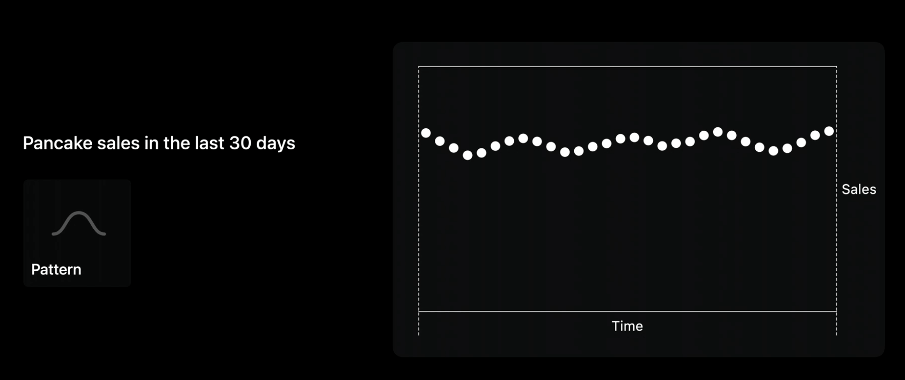
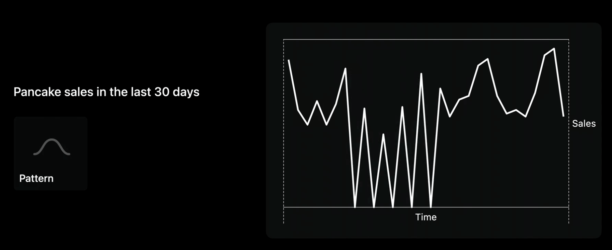

By identifying your app’s needs, you can decide when to use charts, how to use charts, and what design system will unify them.
> This important first step of the design process can be found at [Design app experiences with charts](https://developer.apple.com/videos/play/wwdc2022/110342)

In this talk, we will dive into the next part of the process: how to design a chart.

**An effective chart**
- Focused
- Approachable
- Accessible

----

Good chart design begins with identifying the chart’s goal. For example, a goal to communicate information like ‘Pancake sales in the last 30 days’ may go in many directions.

- Pattern: how sales are fluctuated
- Range: how big these fluctuations were
- Value: examine specific day
- the list can go on and on…

> An effective chart focuses on a few key pieces of information. Design charts with intention.
 
----

## **Five topics of our design process**
- Marks: the visual building blocks
- Axes: provide framing for marks
- Descriptions: make charts more approachable and easy to interpret
- Interaction: deeper exploration of data & critical to accesibility
- Color: add personality & enhance clarity

### Marks
- Design for goals and data
- Make accessible in VoiceOver: for all the information you show visually, you also need to design how to represent it non-visually.
	- Navigate data values
	- Use Audio Graphs

As we choose our mark, we will pay close attention to pattern. It would be useful for our food truck owner to see any fluctuations or trajectories in their sales. We will start with time and pancake sales on our axises. One option for a mark is to use points to represent each day of pancake sales.

Envisioning nice smooth data like this, points look great. But real data is rarely this neat.

WIth realistic data, using points make it difficult to make out any pattern.
> It’s important to test your desings with real data early.

To make the pattern of sales easier to see, we can connect sales counts by using a line mark. Lines are great at representing rates of change.

Here patterns and trajectories are clear.But what if our food truck needed to close for five alternative days?

In this situtaion the segements connecting far-apart values become more prominent than the values themselves.
> Remember to design for a variety of scenarios in your data.

Bar marks are more flexible for our chart. Here, zeros are visible without creating a distraction.

This chart are more intuitive to read: more white means more sales.

### Axes

- Consider the range
	- Fixed range
	- Dynamic range
- Tailor the density of grid lines and labels

### Descriptions

- Provide context
- Summarize the main take-away
- Use Audio Graphs

Providing descriptions that contextualize the data and summarize key take-aways eases readers into your charts. It makes the chart more approachable and accessible for everyone.

### Interaction

- Use large touch targets
- Design multiple types of input
	- Touch
	- Mouse
	- Keyboard
	- Voice Control
	- Switch Control
	- VoiceOver
- Design accessibility labels
	- Succinct
	- Spell entire words
	- Context first

### Color

- Use color to enhance
- Consider associated meanings
	- Different colors of gain & lost in stock app for different culture
- Balance visual weight
- Choose distinct colors
	- Not only distinct from each other, but also from the background
- Respect system settings
	- Dark Mode/Light Mode
	- Increase Contrast
